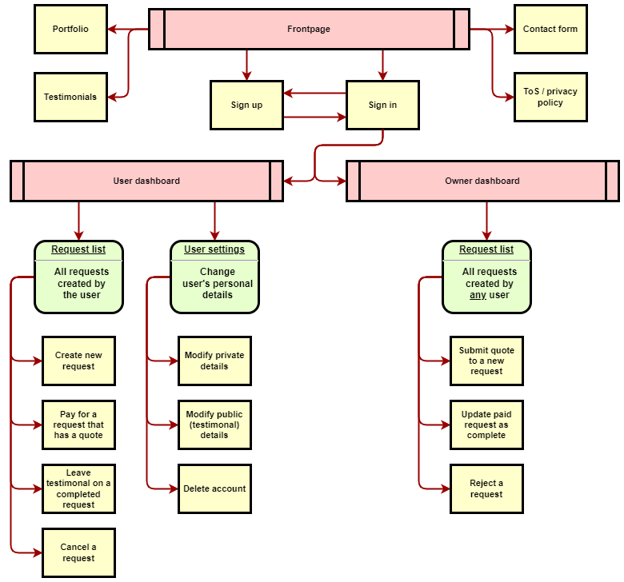

# Portfolio: UX design notes

## Concept

As a last project of the course, I felt it would be a good idea to create a portfolio website, showcasing and providing links to projects I'm most proud of. A portfolio website is a great entry point for anyone interested in knowing more about my skills, and a fantastic addition to anyone's professional profile.

To fulfill the project requirement of e-commerce functionality, the website will feature a commissioning system. A client will be able to request a quote with their project details. The website owner then responds with the quote amount, or rejects the request for any reason such as spam or insufficient details. If accepted, the client can then choose to pay the amount on the quote via an integrated Stripe checkout, or reject the quote.

If paid, the website owner will begin work on the project. They will be sending updates on the project to the client, with the final update marking the project as finished. Once finished, the client can choose to write a testimonial, which will then appear on the frontpage.

Every time a client performs an action the website owner is emailed, as well as the client themselves for confirmation. Similarly, when the website owner performs any action on a client's request, both will be emailed.

## Market research

There is a countless number of web design freelancers and agencies, so competition is fierce. To limit this to local competitors only, I looked for examples only within ones that operate in Ireland.

-   https://ivan.ie/ (Freelancer)
-   https://dmacmedia.ie (Agency)
-   https://www.irelandwebsitedesign.com (Agency)
-   https://designburst.ie (Agency)
-   https://littlebluestudio.ie (Agency)

The most obvious similarity is that all of these sites are very neutral in styling. This allows the content to take stage, especially the showcases of the projects they worked on, which could otherwise clash with the portfolio page's style. The sites feature many gratuitous CSS effects, carousels, etc. The intent is clearly to showcase their expertise at web design, but often comes off as visual noise that obscures information.

Typical sections are an eye-catch at the top with a slogan, followed by more details of services offered, examples of finished projects, and finally contact information. This order of presentation is in line with what the potential viewer wants to know as they read through the page.

There are many signs of the sites heavily employing all SEO practices. Keywords are included in the copy, usually flowing pretty well as human-readable content. Some more obvious stuffing is present on some of these however.

## Scope

There's no reason to deviate much from the visual design style of a typical portfolio website. Fancy effects are not needed, and the design will focus on communicating the ability to present content in a frictionless manner.

The discerning feature will be the integrated commissioning functionality. Using role-based access controls, clients will create an account and then begin a project by sending a quote request. The website will handle the entire lifecycle of a commission, from concept through checkout to completion. Any out-of-band communication with the developer (website owner) can be handled via email.

Let's break down MVP features into individual items:

-   An attractive frontpage to introduce visitors to the owner's services:
    -   Eyecatch section with background and slogan,
    -   Projects section introducing previous finished projects with a brief description,
    -   Testimonials section (if there are any to display,)
    -   Contact section, explaining the commission process and "create an account" call to action,
    -   Sign-up and sign-in functionality, with a "Remember me" checkbox. Both redirect the user to their dashboard.
-   User dashboard:
    -   Section with all of the user's projects and their current state,
    -   Button to create a new project,
    -   Links to sign out and modify user details,
    -   Option to create a testimonial after a project is delivered,
    -   Project editor, where a registered user can detail their project request to receive a quote for it,
    -   Checkout page, where a project with a quote can be paid for.
-   Owner dashboard:
    -   A listing of all projects created by users and their current states,
    -   Owner project editor, where the owner can update the state of a project by canceling or it sending a quote,
    -   Update editor, where the owner can send an update to a user with current state of a project in progress or mark it as delivered.
-   Email sending for both owner and relevant user on any project update,
-   Privacy Policy and Terms of Service pages.

## Interaction design

The flow of interaction between pages is illustrated below:

The original file in [draw.io](https://app.diagrams.net) format is available [here](interactions.drawio).
