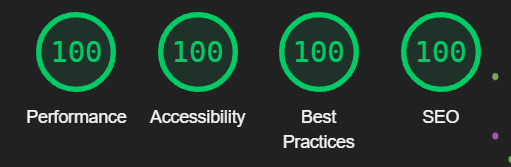

# Portfolio: UX design notes

## Validation

The code was entered through the respective validators.

### HTML

Validator: https://validator.w3.org/nu/

Input: "View page source" output from the following views:

-   Frontpage
-   Sign-up page
-   Dashboard
-   Payment page

Outcome: No errors.

### CSS

Validator: https://validator.w3.org/nu/

Input: `static/css/style.css`

Outcome: No errors.

### Python

Validator: PEP8

Input: All Python source files, scanned continuously by the IDE during development

Outcome: No errors in the final version; they were resolved as they were encountered

### Lighthouse

Perfect score.

