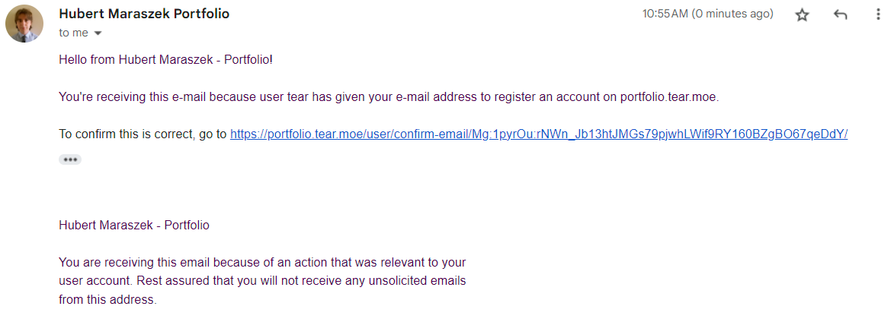
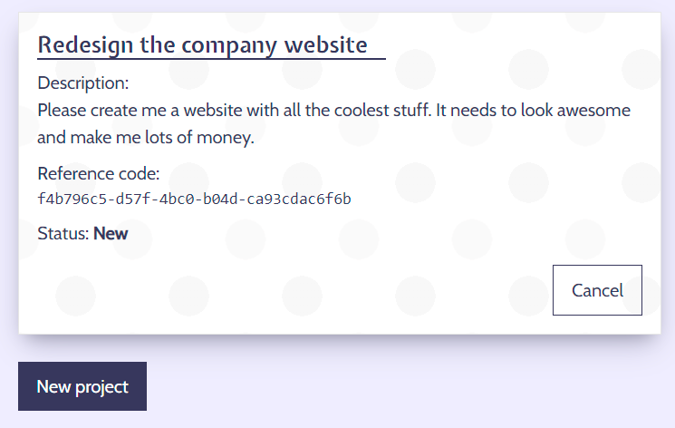
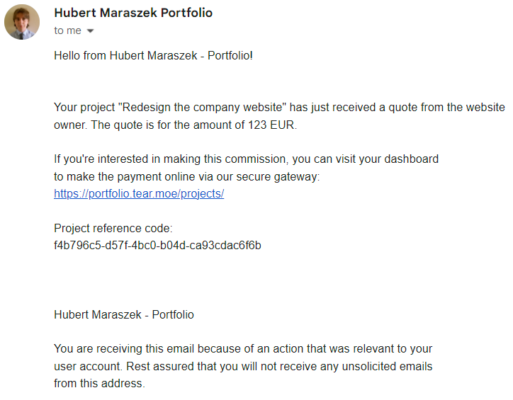

# Portfolio: UX design notes

## Validation

The code was entered through the respective validators.

### HTML

Validator: https://validator.w3.org/nu/

Input: "View page source" output from the following views:

-   Frontpage
-   Sign-up page
-   Dashboard
-   Payment page

Outcome: No errors.

### CSS

Validator: https://validator.w3.org/nu/

Input: `static/css/style.css`

Outcome: No errors.

### Python

Validator: PEP8

Input: All Python source files, scanned continuously by the IDE during development

Outcome: No errors in the final version; they were resolved as they were encountered

### Lighthouse

Perfect score.

## Manual testing

The [deployed](../README.md#portfolio-a-showcase-and-commission-website) website had its functionality tested with a manual procedure of checking the outcome of every feature against the expected result.

### 1. Basic coherence and responsiveness

Procedure:

1. Open the website URL,
2. Scroll to the bottom,
3. Ensure there are no broken images and there's no overlap in the layout,
4. Repeat the above on a mobile-size display.

Expected:

The site appears correctly. All assets are loaded. The sticky header and section heading work correctly and smoothly, without layout jitter or sudden jumping. Site doesn't scroll horizontally. Layout is coherent, with no overlaps on any screen size.

Outcome: As expected.

### 2. Static pages and 404

Procedure:

1. Open the Privacy policy page from the link in the footer,
2. Open the Terms of service page from the link in the footer,
3. Open an invalid URL, such as /foo/.

Expected:

The pages display and have their expected contents. The 404 page displays a message and directs the user back to the homepage, rather than exposing any internal errors.

Outcome: As expected.

### 3. Sign-up process

Procedure:

1. Click the sign-up link in the header,
2. Fill in all the details, including a valid email address,
3. Submit, and wait for an email to arrive at the provided address,
4. Click the link in the email and confirm the email,
5. Try opening the confirmation link from the email a second time,
6. Try signing up again with the same email to generate an error.

Expected:

The sign-up process is smooth and guides the user at every step of the way. The user must confirm their email address after signing up. Trying to use the same confirmation link twice results in a readable error. Likewise, any issue during sign-up like a repeated account is clearly shown near the form.

Outcome: As expected.

### 4. Sign-in and sign-out

Process:

1. Click the sign-in link in the header,
2. Sign-in with previously created details,
3. Sign-out using the link in the header.

Expected:

User is able to sign-in following successful sign-up with email verification. They are also able to sign out, returning to the initial state. Change in sign-up state reflects by header links changing to the actions the user can take.

Outcome: As expected.

### 5. Contact form

Process:

1. Open the contact form with the link in the "Contact" section of the frontpage,
2. Submit the contact form,
3. Wait for email to arrive at the website owner's address.

Expected:

User is able to send a contact form message. The message arrives at the website owner's email.

Outcome: As expected.

### 6. User profile

Process:

1. Sign in as an existing user,
2. Click the "User settings" link in the header,
3. Ensure that data matches that was input during sign-up,
4. Change any of the data,
5. Make sure it reflects the next time the User settings are opened.

Expected:

User sees their existing profile details, and are able to change them successfully.

Outcome: As expected.

### 7. Forgotten password

Process:

1. Visit the sign-in page while signed out,
2. Click the "Forgot password?" button to open the forgotten password page,
3. Generate a password reset link,
4. Confirm the email was received and click the link inside,
5. Change the password,
6. Confirm the password change was successful by signing in,
7. Try to open the password change link again to receive an error.

Expected:

User is able to change their password via the link in the email, and every step of the process is confirmed with a message. The password change link cannot be used again.

Outcome: As expected.

### 8. Create project

Process:

1. As a signed-in user, confirm that dashboard is showing how to create a project and follow the "New project" button,
2. Fill in the details and push "Create project",
3. Confirm that the new project is now shown on the dashboard in "New" state,
4. Check for email on the user's address,
5. Check for email on the website owner's address.

Expected:

A signed-in user is instructed on how to create a project. Going through the process displays the new project in the dashboard, and sends the email to both themselves and the website owner.

Outcome: As expected.

### 9. Cancelling and rejecting projects

Process:

1. As admin, visit the dashboard and reject a new project,
2. Confirm that the user received a rejection email,
3. As user, visit the dashboard and cancel their project,
4. Confirm that the admin received a cancel confirmation email.

Expected:

The admin is able to cancel a project in any state besides completed, reject a project in new state, and the user can cancel their project before it's paid. All of these state changes need to be confirmed via a pop-up window, and inform the other party via a confirmation email.

Outcome: As expected.

### 10. Sending a quote

Process:

1. As admin, open the dashboard, find a project in a "new" state and send a quote to the user,
2. Confirm that the user received an email about the quote.

Expected:

Admin is able to put in a quote value, and confirming this puts the project in payable state and informs the project owner via email.

Outcome: As expected.

### 11. Paying for a project

Process:

1. As user, open the dashboard, find a project in payable state, and push the "Pay now" button.
2. Put test card details (4242 4242 4242 4242, any expiry date in the future, any CVC) and submit the payment,
3. Confirm that the project changed state to "In progress".

Expected:

The user is able to make a payment with a test card.

Outcome: As expected.

